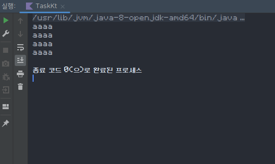
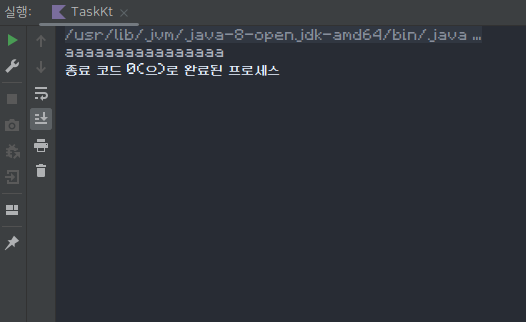

함수
-----

Kotlin 의 함수는 수학에서의 함수와 비슷합니다.

그러나, 수학에서의 함수와 다르게 입력값이 0개부터 무한개까지 가능하고, 결과값은 0개 또는 1개가 있습니다.
또한, 함수의 입력값이 동일해도 결과값이 다르게 나올 수 있습니다.
함수는 여러 행동 또는 연산들을 하나로 압축해 놓은 것이기 때문에 프로그래밍에서는 입력값이 동일해도 다른 결과값이 나올 수 있습니다.

### 함수 호출하기
함수는 다음과 같은 방식으로 호출할 수 있습니다:
```kotlin
function(값1, 값2, 값3, 값4....)
```

이를 실질적으로 이용한 예시는 다음과 같습니다.

```kotlin
println("안녕하세요!") // 입력값 1개만 받는 함수
database.flush() // 입력값을 안받는 함수
```

#### 함수 반환값 사용하기
함수의 결과값, 또는 반환값은 다음과 같이 변수와 사용될 수 있습니다:
```kotlin
val y = f(x)

// 아참, 아래 구문은 불가능합니다, val 은 한번 값을 정하고 나면 수정될 수 없습니다.
y = 123 
```
위 코드를 실행하였을 때, `f(x)` 의 결과값이 `2` 였다면, 변수 `y`의 값은 `2` 가 됩니다.

근데 `2`가 아니라 `3` 이었다면 `y` 의 값은 `3`이 되었겠지요.


#### 함수 호출이 가능한 곳들
함수 호출은 다음과 같은 경우에서만 할 수 있습니다
```kotlin
val a = f(2)
fun main(args: Array<String>) {
    
}

```

### 함수 정의하기
함수는 다음과 같은 방식으로 정의할 수 있습니다:

```kotlin
fun 함수 이름(입력 1번 이름: 데이터 타입, 입력 2번 이름: 데이터 타입, 입력 3번 이름: 데이터 타입...): 결과의 데이터의 타입 {
    //  다른 코드 구문들
    return 결과 // 결과값이 있는 함수라면 무조건 return 을 사용해야 합니다.
}
```
만약 함수의 결과가 없다면, 결과의 데이터 타입을 정의하지 않아도 됩니다.
이름과 입력값이 다 동일한 함수 2개를 정의하는 것은 불가능합니다.
```kotlin
fun f(x: Int): Int {
    
}

fun f(x: Int){

}

fun f(x: Int): Int {
    val b = 2
}
```

#### 함수의 흐름
함수는 함수 안의 코드를 한줄한줄씩 실행합니다.
```kotlin
fun f(x: Int) {
    println("a") // 1
    val a = x * 2 // 2
    val b = x * x // 3
    val c = 2 // 4
    val d = a * b * c * d // 5
}
```
이렇게 위에서 아래로 차례차례 실행하는 것을 보고 함수의 흐름이라고 합니다.
흐름이 종료된다, 또는 흐름이 끝난다는 것은 함수에 정의된 코드 실행이 중단 또는 완료되었다는 것입니다.
이 경우에는 `val d = a * b * c * d` 까지 실행하고 나면, 더 이상 코드가 없으니 함수 흐름이 중단된다고 볼 수 있습니다.

#### return 이란?
return 은 함수의 흐름을 당장 중단하고, 함수가 결과를 바로 출력하도록 합니다.
```kotlin
fun f(x: Int): Int {
    val a = x * 2 // 실행됨, a 의 값은 2 * 2 = 4     실행 순서: 1
    val b = a * 2 // 실행됨, b 의 값은 a * 2 = 4 * 2 = 8     실행 순서: 2
    return b // 실행됨, 함수 바로 중단하고 b 를 결과로 출력함. 이때 b 는 8     실행 순서: 3
    val c = b * 2 // 실행 안됨, 위 return 에서 모든게 중단되었음.     실행 순서: 실행 안됨
}

val y = f(2) // y 의 값은 8 이 됨
```
이떄 `val c = b * 2` 는 실행되는 경우가 없습니다, 언제나 `return b` 에서 함수가 중단되고 b 의 값을 바로 반환해 버립니다.


이를 사용한 예시는 다음과 같습니다
```kotlin
fun square(a: Int, b: Int): Int {
    val result: Int = a * b // 이때, : Int 는 생략 가능, a * b 의 데이터 타입은 자동으로 Int 라고 추론됨.
    return result
}
```

만약 결과값이 없다면 return 을 사용하지 않아도 됩니다.

```kotlin
// 아래 함수는 결과값이 지정되지 않았음 -> 결과값이 없음
fun f(x: String) {
}
```

그러나 return 을 사용해 바로 흐름을 중단할 수는 있습니다.
```kotlin
fun f(x: String) {
    val a = 2 // 실행 순서: 1
    val b = 3 // 실행 순서: 2
    val c =4 // 실행 순서: 3
    return // 실행 순서: 4
    val d = 5 // 실행 안됨
}
```
결과값이 지정되지 않은 함수들은 위 예시처럼 `return` 뒤에 아무것도 없을 수 있습니다,

```kotlin
fun f(x: String): String {
    val c = "ccc"
    return // 불가능
    return c // 가능
}
```

### 메인 함수
`fun main(args: Array<String>)` 은 무엇일까요?
함수의 이름이 main 인 함수들은 메인 함수라고 부릅니다.
이 함수는 운영체제에서 직접 호출하는 함수입니다.
메인 함수는 프로그램이 실행될 떄 호출되며, 메인 함수가 끝나면 프로그램은 종료됩니다.
그렇기에 많은 애플리케이션들은 여러가지 메인 함수가 종료되지 않도록 합니다.

### print 와 println
`println("aaaa")` 또한 함수입니다.
입력값을 하나만 받으며, 입력값을 사용자에게 표시하는 함수입니다
결과값은 없습니다.


```kotlin
println("aaaa")
println("aaaa")
println("aaaa")
println("aaaa")
```


`println` 은 한번씩 실행할때마다 다음줄로 넘어갑니다

`print` 는 다음줄로 넘어가지 않습니다
```kotlin
print("aaaa")
print("aaaa")
print("aaaa")
print("aaaa")
```
