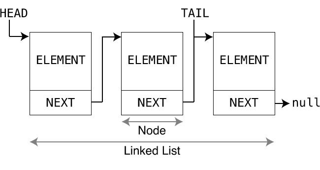

리스트
=======



리스트는 Node 라는 클래스의 인스턴스 여러개가 줄줄이 이어져있는 형태의 자료구조로, 이 인스턴스들은
String, 정수, 또는 다른 클래스의 인스턴스 등 여러 형태의 정보들을 저장할 수 있다.
이때 Node 의 인스턴스를 요소라고 하기도 한다.

### 배열과의 차이점
배열은 크기가 사전에 미리 지정되어 있어야만 하며, 그 크기를 넘어설 순 없다.
리스트는 저장된 요소 갯수가 얼마든지 늘어날 수 있으며, 메모리 사용량도 그에 따라 증가한다.
그러나 리스트는 조회가 배열에 비해 느리다.

### 리스트 만들기

```kotlin
val list = LinkedList<String>() // 리스트의 인스턴스 생성
list.add("a") // a 추가
list.add("b") // b 추가
list.add("c") // c 추가
```
또는
```kotlin
val list = listOf("a", "b", "c") // 수정할 수 없는 리스트 생성
```

### 리스트의 종류

| 이름          | 특징                                                                                   |
|-------------|--------------------------------------------------------------------------------------|
| List        | 리스트의 가장 기본적인 형태. 인터페이스이고, 요소 추가 및 삭제를 위한 메서드는 제공되지 않음.                               |
| MutableList | 수정 가능한 리스트. 인터페이스이고, 요소 추가 및 삭제를 위한 메서드도 제공됨.                                        |
| ArrayList   | 배열을 리스트처럼 사용할 수 있도록 만든 것. MutableList 를 구현하며, 요소 추가 및 삭제가 가능하긴 하나 느림. 조회는 빠름.        |
| LinkedList  | Node 가 줄줄이 이어져 있는 형태의 리스트. MutableList 를 구현하며, 요소 추가 및 삭제가 매우 빠름. 그러나 조회는 배열에 비해 느림. |

### 주의사항들
```kotlin
val list = LinkedList<Int>()
list.add("a") // 불가능, "a" 는 Int 가 아님
```
```kotlin
val list = listOf("a", 1)
// 이때 위 list 의 타입은 List<Comparable<*>> 가 됨.
// 근데 별로 유용하진 않은 타입이라, 리스트를 활용하기 어려움
```
```kotlin
val list = LinkedList<Int>()
list.add(1)
list.add(2)
list.add(3)
list.add(4)
list[4] = 5 // 불가능, 5번째 요소는 아직 존재하지 않음
list[3] = -4 // 가능, 3번째 요소는 4 임. 3번째 요소의 값이 4 에서 -4 로 변경될 것
```

### 리스트 활용 방법들
```kotlin
val list = mutableListOf(1, 2, 3, 4, 5)
list.add(6)
list += 7

println(list[6])

val arrayList = arrayListOf(1, 2, 3, 4, 5, 6)
println(arrayList[0])


for(element in list) {
    println(element)
}

list.forEach { // 람다에 대해서는 나중에 할 것
    println(it)
}

println(list.size)
list.remove(1) // 이제 리스트의 내용은 [2,3,4,5,6,7] 임

val combined = list + arrayList // combined 의 내용은 [2,3,4,5,6,7,1,2,3,4,5,6]
```